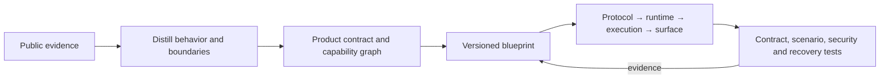

<p align="center">
  
</p>

<h1 align="center">Harness Distiller</h1>

<p align="center">
  <strong>One prompt to distill and rebuild Codex, Claude Code, QoderWork, and other AI agent harnesses.</strong>
</p>

<p align="center">
  <a href="README.zh-CN.md">简体中文</a> ·
  <a href="SKILL.md">Codex Skill</a> ·
  <a href="references/catalog.md">Product Catalog</a> ·
  <a href="references/architecture.md">Architecture</a>
</p>

<p align="center">
  <a href="https://github.com/414960701/harness-distiller/stargazers"></a>
  <a href="LICENSE"></a>
  <a href="https://github.com/414960701/harness-distiller/commits/main"></a>
</p>

Name the product recipe, maturity level, and target surface. Harness Distiller loads the evidence-backed product dossier, expands the capability graph, and drives Codex to generate or upgrade the target repository with the matching protocol, runtime, tools, permissions, persistence, UI, and acceptance tests.

Start with a Codex-like TUI, a Claude Code-like CLI, or a QoderWork-like desktop workbench. The same one-prompt workflow also supports Aider, OpenCode, OpenHands, AgentScope, LangGraph, and Deep Agents recipes.

> Pick a recipe. Point it at a repository. Distill, rebuild, validate, and keep upgrading one compatible harness.

## One prompt, one product recipe

```text
Use harness-distiller to rebuild a usable Codex-style headless + TUI agent in this repository.
```

```text
Use harness-distiller to replicate a productive Claude Code-style headless + CLI agent here.
```

```text
Use harness-distiller to build a polished QoderWork-style headless + desktop agent workbench.
```

Harness Distiller does not copy proprietary prompts, branding, or unverifiable internals. It reproduces the publicly evidenced behavior and product architecture as an original, testable implementation.

## At a glance

| What is included | Current coverage |
| --- | ---: |
| Implementation-ready knowledge modules | 35 |
| Full product dossiers | 9 |
| Documents per full dossier | 13 |
| Maturity levels | 4 |
| Dependency-free validation scripts | 5 |
| JSON Schema contracts | 3 |

## What you get

- One-prompt generation and in-place upgrades for complete agent harness repositories
- Codex, Claude Code, and QoderWork flagship recipes, plus six additional implementation-grade recipes
- A single capability model that grows through `runnable` → `usable` → `productive` → `polished`
- Product recipes based on public evidence, with facts and inference kept separate
- Contracts for commands, events, tools, state, permissions, execution, and UI projection
- Implementation guidance for context, storage, recovery, sandboxing, observability, plugins, and multi-agent work
- Deterministic blueprint generation and repository validation using only the Python standard library
- Acceptance criteria that prevent “implemented” and “verified” from becoming hand-wavy labels

## Product dossiers

Each completed dossier contains a product contract, architecture, agent loop, protocol and state model, context and tools, workspace execution, safety, persistence and recovery, UX analysis, recipe, sources, and level-by-level acceptance tests.

| Recipe | Dossier | Best starting surface |
| --- | --- | --- |
| Codex | [Open](references/products/codex/index.md) | Rust · headless/TUI |
| Claude Code | [Open](references/products/claude-code/index.md) | TypeScript · headless/CLI |
| QoderWork | [Open](references/products/qoderwork/index.md) | TypeScript + Tauri · desktop |
| Aider | [Open](references/products/aider/index.md) | Python · headless/CLI |
| OpenCode | [Open](references/products/opencode/index.md) | TypeScript/Bun · headless/TUI |
| OpenHands | [Open](references/products/openhands/index.md) | Python + React · web/SDK |
| AgentScope | [Open](references/products/agentscope/index.md) | Python · headless/SDK |
| LangGraph | [Open](references/products/langgraph/index.md) | Python · headless/SDK |
| Deep Agents | [Open](references/products/deep-agents/index.md) | Python · headless/SDK |

The broader catalog plans 21 implementation-grade dossiers. The repository currently has 9 complete dossiers; progress is reported honestly by the inventory script.

## Quick start

### Install as a Codex Skill

```bash
git clone https://github.com/414960701/harness-distiller.git \
  ~/.codex/skills/harness-distiller
```

Then ask Codex:

```text
Use harness-distiller to rebuild a usable Codex-style headless + TUI agent in this repository.
```

Or in Chinese:

```text
用 harness-distiller 在这个仓库一键复刻一个 usable 级的 Codex 风格 headless + TUI Agent。
```

### Generate a harness blueprint

```bash
python3 scripts/new_blueprint.py \
  --target /path/to/project \
  --recipe codex \
  --level usable

python3 scripts/validate_blueprint.py /path/to/project
```

The generated blueprint uses JSON syntax, which is valid YAML 1.2, so the workflow stays dependency-free.

## How the distillation works



The four maturity levels share one protocol, state model, and module boundary. Upgrades add capabilities and migrations instead of generating four incompatible systems.

## Repository map

```text
SKILL.md                         Codex Skill entry point and workflow
agents/                          Agent configuration
assets/contracts/                Blueprint, event, and tool JSON Schemas
references/architecture.md       Shared architecture boundaries
references/implementation/       Implementation specifications
references/knowledge/            Reusable capability modules
references/products/             Product dossiers, recipes, and tests
references/workflows/            Build, upgrade, and validation workflows
scripts/                         Blueprint and consistency tooling
```

## Validate the knowledge base

```bash
python3 scripts/check_inventory.py
python3 scripts/validate_knowledge.py
python3 scripts/validate_dossier.py
```

`check_inventory.py --strict` additionally requires all 21 planned product dossiers to be complete.

## Design principles

- Label evidence as `code`, `official-doc`, `protocol`, `behavior`, or `inference`.
- Keep the runtime headless; surfaces communicate through versioned commands and events.
- Separate approval policy from OS-, container-, path-, and network-level enforcement.
- Preserve atomic tool call/result pairs through cancellation, compaction, and replay.
- Rebuild UI state from snapshots and events, not in-memory runtime objects.
- Call a capability verified only when executable evidence exists.

## Contributing

Issues and pull requests are welcome. The highest-impact contributions are:

- English translations for the knowledge base and product dossiers
- New implementation-grade product dossiers using the existing 13-document structure
- Stronger sources, version pins, black-box acceptance tests, and reproducible traces
- Additional protocol, security, recovery, and migration fixtures

Please run the relevant validation scripts before opening a pull request.

## License

[MIT](LICENSE) © 2026 414960701
