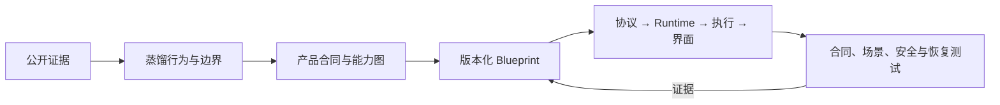

<p align="center">
  
</p>

<h1 align="center">Harness Distiller</h1>

<p align="center">
  <strong>一条指令蒸馏并复刻 Codex、Claude Code、QoderWork 等 Agent Harness。</strong>
</p>

<p align="center">
  <a href="README.md">English</a> ·
  <a href="SKILL.md">Codex Skill</a> ·
  <a href="references/catalog.md">产品目录</a> ·
  <a href="references/architecture.md">共享架构</a>
</p>

说出目标产品、成熟度和产品表面，Harness Distiller 就会加载对应产品 dossier、展开能力依赖，并驱动 Codex 在目标仓库中生成或原位升级匹配的协议、Runtime、工具、权限、持久化、界面和验收测试。

你可以一条指令复刻 Codex 风格 TUI、Claude Code 风格 CLI，或 QoderWork 风格桌面工作台。同一流程也支持 Aider、OpenCode、OpenHands、AgentScope、LangGraph 和 Deep Agents 配方。

> 选产品、指仓库：一键蒸馏、一键复刻、自动验收，并沿同一架构持续升级。

## 一条指令，复刻一个产品配方

```text
用 harness-distiller 在这个仓库一键复刻一个 usable 级的 Codex 风格 headless + TUI Agent。
```

```text
用 harness-distiller 在这里复刻一个 productive 级的 Claude Code 风格 headless + CLI Agent。
```

```text
用 harness-distiller 构建一个 polished 级的 QoderWork 风格 headless + Desktop Agent 工作台。
```

Harness Distiller 不复制专有提示词、品牌素材或无法验证的内部实现；它复刻的是有公开证据支撑的产品行为与架构，并生成原创、可测试的工程实现。

## 当前内容

| 内容 | 数量 |
| --- | ---: |
| 可直接用于实现的共享知识模块 | 35 |
| 完整产品 dossier | 9 |
| 每个完整 dossier 的文档 | 13 |
| Harness 成熟度等级 | 4 |
| 无第三方依赖的校验脚本 | 5 |
| JSON Schema 合同 | 3 |

## 能做什么

- 一条指令生成完整 Agent Harness 工程，或在原仓库中跨级升级
- 以 Codex、Claude Code、QoderWork 为旗舰配方，并支持另外六套实现级配方
- 按 `runnable`、`usable`、`productive`、`polished` 四级规划能力演进
- 生成一套可连续升级的 Harness blueprint，而不是四套互不兼容的工程
- 复用 Codex、Claude Code、QoderWork、Aider、OpenCode、OpenHands、AgentScope、LangGraph、Deep Agents 等产品配方
- 为协议、运行时、上下文、工具、权限、执行、存储、恢复和 UI 提供实现规范
- 用 contract、scenario、security、recovery 和 migration 测试定义“已验证”
- 用 Python 标准库脚本检查知识模块、产品 dossier 和 blueprint 的完整性

## 产品 dossier

| 产品配方 | 文档入口 | 推荐起始表面 |
| --- | --- | --- |
| Codex | [查看](references/products/codex/index.md) | Rust · headless/TUI |
| Claude Code | [查看](references/products/claude-code/index.md) | TypeScript · headless/CLI |
| QoderWork | [查看](references/products/qoderwork/index.md) | TypeScript + Tauri · desktop |
| Aider | [查看](references/products/aider/index.md) | Python · headless/CLI |
| OpenCode | [查看](references/products/opencode/index.md) | TypeScript/Bun · headless/TUI |
| OpenHands | [查看](references/products/openhands/index.md) | Python + React · web/SDK |
| AgentScope | [查看](references/products/agentscope/index.md) | Python · headless/SDK |
| LangGraph | [查看](references/products/langgraph/index.md) | Python · headless/SDK |
| Deep Agents | [查看](references/products/deep-agents/index.md) | Python · headless/SDK |

产品目录规划了 21 个实现级 dossier，当前已完成 9 个。库存脚本会如实报告进度，不把规划中内容写成已完成。

## 作为 Codex Skill 安装

```bash
git clone https://github.com/414960701/harness-distiller.git \
  ~/.codex/skills/harness-distiller
```

安装后，可以在 Codex 中这样使用：

```text
用 harness-distiller 在这个仓库一键复刻一个 usable 级的 Codex 风格 headless + TUI Agent。
```

也可以直接阅读 [SKILL.md](SKILL.md)，按其中的路由加载所需参考资料。

## 生成 Blueprint

```bash
python3 scripts/new_blueprint.py \
  --target /path/to/project \
  --recipe codex \
  --level usable

python3 scripts/validate_blueprint.py /path/to/project
```

Blueprint 使用 JSON 语法；JSON 同时也是合法 YAML 1.2，因此整个流程不需要第三方依赖。

## 工作方式



四个成熟度等级共用同一协议、状态模型和模块边界。升级只增加能力与迁移，不生成互不兼容的四套系统。

## 目录

```text
SKILL.md                         Codex Skill 入口与工作流
agents/                          Agent 配置
assets/contracts/                Blueprint、事件与工具 JSON Schema
references/architecture.md       共享架构边界
references/implementation/       可直接落地的实现规范
references/knowledge/            共享能力知识模块
references/products/             产品 dossier、配方与验收测试
references/workflows/            新建、升级与验收流程
scripts/                         Blueprint 生成与一致性检查工具
```

## 校验知识库

```bash
python3 scripts/check_inventory.py
python3 scripts/validate_knowledge.py
python3 scripts/validate_dossier.py
```

`check_inventory.py --strict` 会额外要求规划中的 21 个产品 dossier 全部完成。

## 设计原则

- 明确区分 `code`、`official-doc`、`protocol`、`behavior` 和 `inference`
- Runtime 保持 headless，各类界面只通过版本化 command/event 协议交互
- Approval policy 与 OS、容器、路径和网络的真实 enforcement 分离
- 工具调用与结果在取消、压缩和重放过程中保持原子配对
- UI 由 snapshot + event 重建，不依赖 Runtime 内存对象
- 只有具备可执行证据的能力才能标记为 verified

## 贡献

欢迎提交 Issue 或 Pull Request。最有价值的贡献包括：

- 补充知识库和产品 dossier 的英文翻译
- 按既有 13 篇文档结构新增实现级产品 dossier
- 补充更强的来源、版本锚点、黑盒验收测试与可复现 trace
- 增加协议、安全、恢复与迁移 fixture

提交前请运行相关校验脚本。

## 许可证

[MIT](LICENSE) © 2026 414960701
